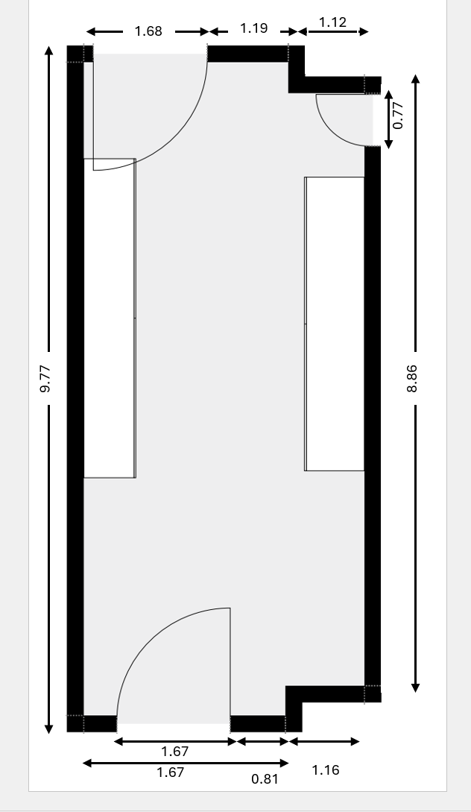

# LoFi: Wi-Fi Sensing Dataset for Localization \& Tracing with ESP32-S3

**Article:** Zijian Zhao, Tingwei Chen, Fanyi Meng, Zhijie Cai, Hang Li, Xiaoyang Li, Guangxu Zhu\*, “[LoFi: Vision-Aided Label Generator for Wi-Fi Localization and Tracking](https://arxiv.org/abs/2412.05074)”, IEEE Globecom GenAI NGN Workshop 2025

**Notice:** We have uploaded our dataset ([RS2002/LoFi · Datasets at Hugging Face](https://huggingface.co/datasets/RS2002/LoFi)) to Hugging Face.


## 1. Dataset Overview

LoFi dataset contains data related to people location \& tracing and people id identification in a utility room scenario. The dataset provides synchronised CSI, RSSI, 2D location coordinates, picture and timestamp for each sample. It can be used for research on **WiFi-based human location \& tracing  and people id identification**.


## 2. Data Format

For privacy considerations, we do not provide raw imagae data. Instead, we provide the processed data (processed by the code in  ``data_process_example``) in ``./data/processed_data.zip`` and original CSI \& RSSI data in ``./data/csi_data.zip``.

The processed aligned data contains information about: CSI, position coordinates, People ID, and timestamp. You can directly use the data in `./data/processed_data/wiloc.pkl`, where we use `-1000` to represent the positions where packet losses occur. You can use interpolation methods or our previous works ([CSI-BERT](https://github.com/RS2002/CSI-BERT), [CSI-BERT2](https://github.com/RS2002/CSI-BERT2)) to recover them.

The raw CSI data contains the following columns:

1. Column B - "seq": This column indicates the row number of each entry.
2. Column C - "timestamp" and Column V - "local_timestamp": These columns represent the UTC+8 time and ESP local time, respectively, when the data was collected.
3. Column G - "rssi": This column represents the RSSI signal.
4. Column AB - "data": This column contains the CSI data. Each row consists of 104 numbers, which can be divided into pairs representing the real and imaginary parts of each subcarrier. Therefore, the complex CSI value of the ith subcarrier can be obtained as a[2i] + a[2i+1]j. In other words, the CSI value of the 52 subcarriers can be represented as [a[1]+a[2]j, a[3]+a[4]j, ..., a[103]+a[104]j].
5. Other columns: These columns provide additional information from the ESP32 device, such as MAC and MCS details.


## 3. Data Collection Detail

| CSI Modality   |                         |
| -------------- | ----------------------- |
| Frequency Band | 2.4Ghz                  |
| Bandwidth      | 20 MHz (52 subcarriers) |
| Protocol       | 802.11n                 |
| Waveform       | OFDM                    |
| Sampling rate  | About 100Hz             |
| Antenna        | 1 antenna per device    |

The sampling rate of our used camera is about 30Hz.




## 4. File Structure

For raw CSI data, the parent root of each csv file indicates the collected person's name.


For ``./data/processed_data.zip``:

We obtain ``csi_data.pkl`` by running ``./data/data_process_example/process_csi1.py`` (extract original CSI data)
We obtain ``data_sequence.pkl`` by running  ``./data/data_process_example/process_csi2.py`` (split CSI data by person)
We obtain ``gt_data.pkl`` by running  ``./data/data_process_example/process_cv.py`` (extract position coordinates from images)
We obtain ``wiloc.pkl`` by running  ``./data/data_process_example/combine_csi_cv.py`` (combine CSI data and ground truth)


## 5. Reference

```
@article{zhao2024lofi,
  title={LoFi: Vision-Aided Label Generator for Wi-Fi Localization and Tracking},
  author={Zhao, Zijian and Chen, Tingwei and Meng, Fanyi and Cai, Zhijie and Li, Hang and Li, Xiaoyang and Zhu, Guangxu},
  journal={arXiv preprint arXiv:2412.05074},
  year={2024}
}
```

