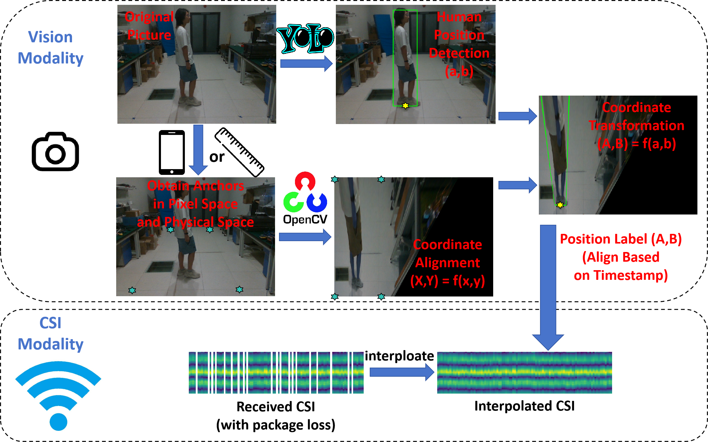

# LoFi: Wi-Fi Sensing Dataset for Location \& Tracing with ESP32-S3

**Author: Zijian Zhao, Tingwei Chen, Fanyi Meng, Zhijie Cai**

## 1. Dataset Overview

LoFi dataset contains data related to people location \& tracing and people id identification in a utility room scenario. The dataset provides synchronised CSI, RSSI, 2D location coordinates, picture and timestamp for each sample. It can be used for research on **WiFi-based human location \& tracing  and people id identification**.

## 2. Data Format

## 3. Data Collection Detail

|                |                         |
| -------------- | ----------------------- |
| Frequency Band | 2.4Ghz                  |
| Bandwidth      | 20 MHz (52 subcarriers) |
| Protocol       | 802.11n                 |
| Waveform       | OFDM                    |
| Sampling rate  | About 100Hz             |
| Antenna        | 1 antenna per device    |

## 4. File Structure

