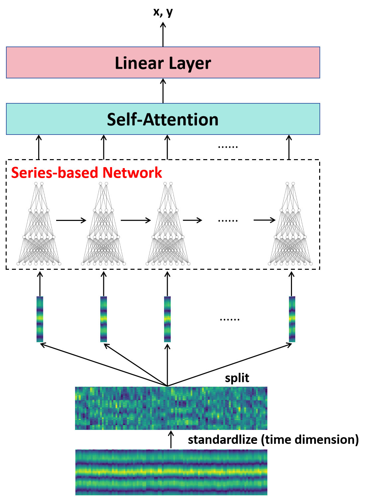

# Examples For LoFi Dataset

We provide two series of benchmark including convolution-based method and time-series based method. You can run them as follows:


## Convloution Based Network


```shell
python train_conv.py --model <please choose from resnet and cnn> --data_path <processed data path>
```


## Time-series Based Network



```shell
python train_series.py --model <please choose from lstm, rnn and gru> --data_path <processed data path>
```


If you want to use [CSI-BERT](https://github.com/RS2002/CSI-BERT) (a CSI time-series network proposed by us previously), you can first pre-train it as:

```shell
python pretrain_csibert.py --GAN --data_path <processed data path>
```

And then finetune it as:

```shell
python train_csibert.py --path <pre-trained model path> --data_path <processed data path>
```

